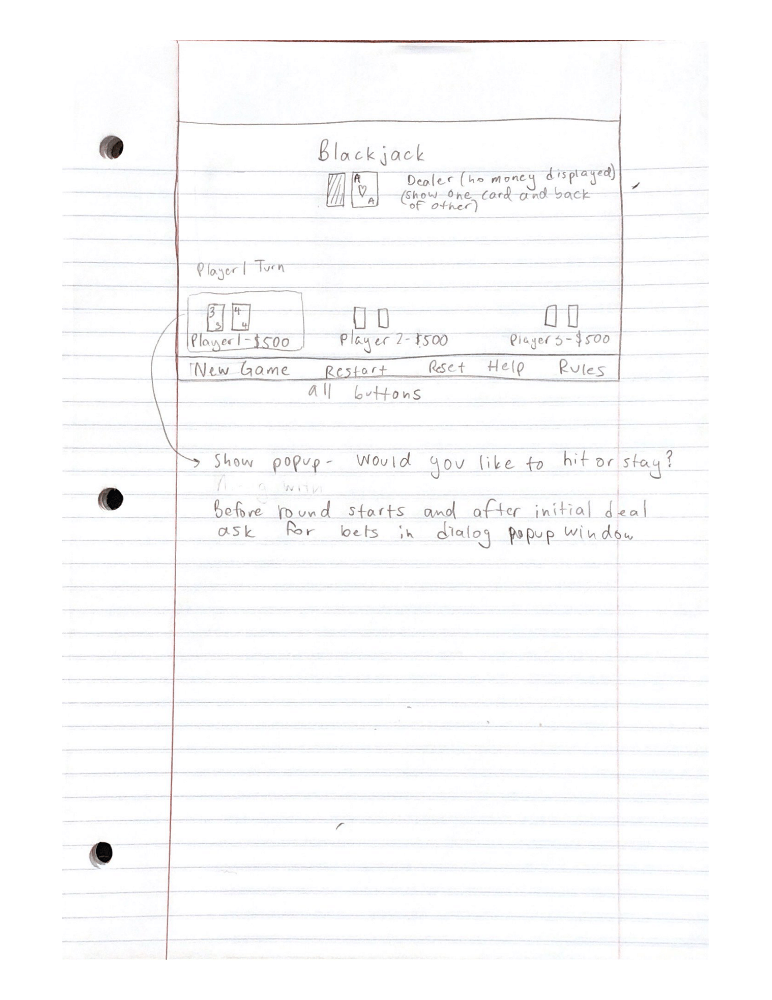

# Final Project Proposal

Ankit Datta - ankitd2 |  Moderator May Sun - chenyus2

Blackjack Java Application

# Project Motivation

The motivation behind this idea was to implement a card game similar to how the Chess game was implemented in Assignment 1. Blackjack is a very common and easy to learn card game that can be played by people of all ages and experience.

My goal for this project is to first design the model or logic behind the cards and rules of blackjack. Then, I will develop a static GUI to display the players' and dealer's hands. Finally, I will add interaction and allow players to request

# Technical Specifications 

- Platform: Java Desktop Application - Mac OS, Windows
- Programming Languages: Java
- Style Conventions: Google Java Style Guide
- IDE: IntelliJ
- Tools/Interfaces: Keyboard and Mouse
- Target Audience: Card Game Lovers

# Functional Specifications

Implement standard basic [Blackjack Rules](https://bicyclecards.com/how-to-play/blackjack/):

Game Logic:

- Blackjack (21)
- Assigning values to all cards
- Aces equal value of 1 or 11
- Face cards all have value of 10
- Face card + Ace is automatic win
- Betting and odds for winning and losing
- Busting if cards add over 21
- Random dealing to players and dealer
- Splitting Pairs

Card Logic:

- 52 cards not repeatable
- 4 suits, 13 cards in each
- Support for multiple decks
- Card shuffling

> Some advanced Blackjack rules and betting such as Insurance and Doubling Down will not be implemented to this version

Assume all players start with same initial money at first.

# Rubrics and Weekly Goals

## Week 1:

Implement card and basic Blackjack game winning/losing rules. Also implement splitting pairs or betting ruels.

| Function | Points  |
|:----------:|:--------:|
| Card Logic | 5  |
| Game Logic | 10  |
| Card Unit Tests  | 5  |
| Game Unit Tests |  5  |

Card Logic:

 - 0: nothing completed
 - -1 pt for repeating cards
 - 5 pts for 52 cards with different suits and colors
 
 Game Logic:
 
 - 0: No game logic
 - 5: Card values implemented 
 - 10: Simulate Blackjack turns and determine if hands are winning or busting
 
 Card Unit Tests:
 
 - 0 pt: No tests
 - 1 pt: JUnit test converage below 50%
 - 2 pt: JUnit test converage below 60%
 - 3 pt: JUnit test converage below 70%
 - 4 pt: JUnit test converage below 80%
 - 5 pt: JUnit test converage above 90%
 
 Game Unit Tests:
 
- 0 pt: No tests
 - 1 pt: JUnit test converage below 50%
 - 2 pt: JUnit test converage below 60%
 - 3 pt: JUnit test converage below 70%
 - 4 pt: JUnit test converage below 80%
 - 5 pt: JUnit test converage above 90%
 
 
## Week 2:
 
Implement User Interface to display cards for players and dealer. No interaction or updating required to show game simulation but new game and game rules information can be added.
 
Add Logic for player betting and paying out from dealer.

Here is a rough sketch of the GUI:

 
| Function | Points  |
|:----------:|:--------:|
| User Interface Implementation | 10  |
| Game Logic and Betting | 5  |
| Manual Test Plan for GUI  | 5  |
| New Game Logic and Betting Tests |  5  |

User Interface Implementation:

- 5 points: Command Line interface - the UI consists of a neat layout that accurately represents a cards. The UI consists of symbols/pictures for each of the chess pieces.
- 10 points: GUI - The UI is extremely appealing and shows that the student has put in considerable effort into the design of the layout. The UI consists of commands/clickable buttons for each tile and basic interactions are enabled in the UI.

Game Logic and Betting:

- 0: no betting or advanced rules added
- 2: betting added but not advanced rules
- 5: betting, splitting pairs, ace double value option added and players money allowed to go into negative but not dealer

Manual Test Plan:

- 5 pts for 10+ page test plan with all properties of project and basic layout of GUI, including displaying player and money, buttons, etc.
- 4 pts for 8+ pages and missing some instructions
- 2 pts for 2-4 pages and only includes start GUI view not testing specific behavior
- 1 pt for only having environment or setup tests
- 0 pts for no test plan

Game Logic Unit Tests:
 
 Now including splitting pairs, betting
- 0 pt: No tests
- 1 pt: JUnit test converage below 50%
- 2 pt: JUnit test converage below 60%
- 3 pt: JUnit test converage below 70%
- 4 pt: JUnit test converage below 80%
- 5 pt: JUnit test converage above 90%

## Week 3:

Implement interactive GUI to allow players to hit or stay with their current hands as well as giving them options to chose value for Ace, adding bets, splitting pairs, etc.

Add ability to have custom starting amounts for players. 

Add restart game, reset round, quit game functions.

| Function | Points  |
|:----------:|:--------:|
| GUI Implementation | 10  |
| Game Logic Updates | 5  |
| Manual Test Plan for GUI  | 5  |
| Game Logic Tests with customization |  5  |

GUI Implementation:

- 5 points: allow players to hit/stay
- 7 points: allow betting and player options to hit/stay
- 10 points: allow custom starting amounts and choice for splitting pairs and betting

Game Logic Updates:

- 0: no custom amounts or rules added
- 2: custom amounts for players
- 5: custom amounts for players, restart game restarts all players with intial values, reset round resets the cards dealt and all bets to start of round

Manual Test Plan:

- 5 pts for 10+ page test plan with all properties of project and tasks such as dealing cards, placing bets, starting new games, etc.
- 4 pts for 8+ pages and missing some instructions
- 2 pts for 2-4 pages and only includes start GUI view not testing specific behavior
- 1 pt for only having environment or setup tests
- 0 pts for no test plan

Game Logic Unit Tests:
 
 
Now including custom starting amounts and bankrupt/dealer bankrupt logic:

- 0 pt: No tests
- 1 pt: JUnit test converage below 50%
- 2 pt: JUnit test converage below 60%
- 3 pt: JUnit test converage below 70%
- 4 pt: JUnit test converage below 80%
- 5 pt: JUnit test converage above 90%

